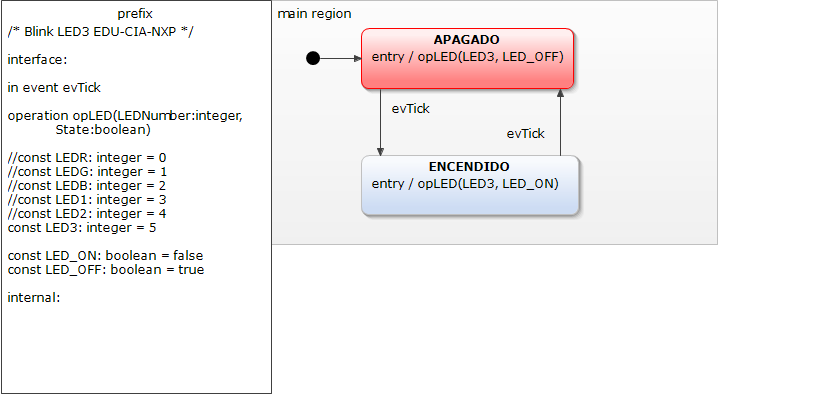

# TP2 de Sistemas Embebidos

## statecharts_bare_metal
### Statechart

El statechart generado por el archivo Blinky.sct se muestra en la figura (). Se observa el lugar donde empieza el diagrama de estados y dos Estados, "APAGADO" y "ENCENDIDO", unidos con flechas simulando un bucle. 



Dentro de cada estado se encuentran las operaciones o funciones que se llaman. En este caso se usa opLED(LEDNumber,State) que es una función que dado un número de LED setea el estado que le pasan en el segundo argumento (LED_ON es encendido y LED_OFF es apagado).
Luego, el sentido de las fechas indican como continua el flujo del programa una vez completada las operaciones dentro del Estado. La palabra "evTick" representa un evento que se activa por interrupción.
En el programa se definen los valores booleanos LED_ON y LED_OFF que indican los estados posibles del LED y las posiciones de cada LED.

### Código generado en base al statechart

El programa comienza de forma similar a los analizados en el TP1. Se hace la inicialización general con boardConfig(), se configura
el tickrate a 1 por milisegundo, y con tickCallbackSet se setea la función de interrupción por tick, myTickHook, que lo único que
hace es setear el flag SysTick_Time_Flag como verdadero. La variable statechart es de tipo Prefix, la estructura de datos que usa
la máquina de estados, y está definida en el archivo "Prefix.h", generado a partir de "prefix.sgen". La función prefix_init
inicializa la máquina de estados asociada a la variable statechart asignándole a todos los elementos del atributo stateConfVector
el valor Prefix_last_state, uno de los 3 estados posibles según el siguiente enum definido en "Prefix.h":
```
typedef enum
{
	Prefix_last_state,
	Prefix_main_region_APAGADO,
	Prefix_main_region_ENCENDIDO
} PrefixStates;
```
Además deja los estados como si no hubiese habido ningún evento.

El programa consiste en un ciclo infinito en el que con cada interrupción se llama a prefixIface_raise_evTick(&statechart) que
activa el evento evTick, y después se ejecuta el ciclo de estados al llamar a prefix_runCycle(&statechart). Esta función recorre
el vector stateConfVector, un atributo de la estructura prefix, de la variable statechart, y según el estado en que se encuentra cada
elemento, se llama a la función main_region_APAGADO_react(handle, bool_true) o main_region_ENCENDIDO_react(handle, bool_true).
Yendo más profundo se llega a la función prefixIface_opLED que es la que, dependiendo de los argumentos, prende o apaga el LED. Esta
función está definida en el main y llama a gpioWrite para cambiar el estado del registro del LED seleccionado para toggearlo.


## Migración

Se migró el proyecto a la carpeta projects/TP2. Se copiaron los archivos que terminan con .-sct, junto con prefix.sct y prefix.sgen.
Se eliminó el archivo prefix.sct de la carpeta original para que el Yakindu reconozca correctamente qué archivo ejecutar. Se modificó
el archivo project.mk, comentando el proyecto anterior y agregando
```
PROJECT = projects/TP2
```
Se eliminó la configuración del debugger, y luego de hacer clean y build, se volvió a abrir la ventana de debug configuration para
crear el archivo TP2.axf, configurando correctamente el debugger para el proyecto actual. El build tuvo errores ya que faltaban las
definiciones que estarían en los archivos generados por el diagrama de estados. Se generaron estos seleccionando la opción Generate
Code Artifacts de prefix.sgen, y luego de hacer nuevamente clean y build, el proyecto estaba listo para ser debuggeado y modificado.
